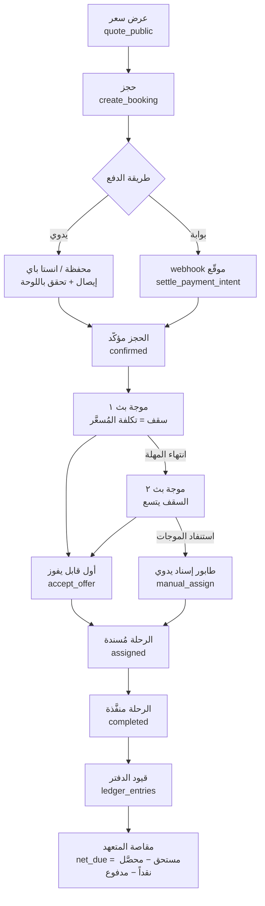

<div dir="rtl">

# منصة النقل السياحي — Tours-01

**وساطة سعة نقل بلا أصول في مصر: سعر فوري للعميل، وتنفيذ يُبَث آلياً إلى المتعهدين فيفوز به أولهم قبولاً.**

</div>


<div dir="rtl">

## ما هذا المشروع

منصة تحجز رحلات النقل السياحي في مصر: العميل يحدد نقطة الانطلاق والوصول وعدد الركاب، فيحصل على **سعر نهائي واحد** لكل فئة سيارة مؤهلة، ثم يحجز كضيف بلا حساب ويدفع كاملاً أو عربوناً. المنصة **لا تملك سيارات ولا تدير سائقين**: الطلب المؤكد يُبَث على موجات إلى **المتعهدين** المغطّين للمسار، وأول من يقبل يفوز بالرحلة، والربح هو الفرق بين ما دفعه العميل وما يستحقه المتعهد. كل حساب مالي أو تسعيري يقع **داخل Postgres** لا في TypeScript، وكل قيمة تخص العلامة التجارية تعيش في قاعدة البيانات فتُطلق النسخة الواحدة باسم وهوية ودومين مختلفين بلا تعديل سطر كود.

**والمنظومة منشورة وتعمل** على [`rentlimousine.duckdns.org`](https://rentlimousine.duckdns.org) منذ 2026-08-15: خادم VPS خلف Nginx بشهادة، والخدمة تحت `systemd`، والنشر بأمرٍ واحد (`deploy.sh`) — والدليل الكامل في [`docs/VPS.md`](docs/VPS.md).

⚠ **لكن البيانات المعروضة اليوم بيانات عرضٍ تجريبي** يزرعها `pnpm demo:seed` (٣٤١ حجزاً وثمانية متعهدين مُحاكين بستة أشهر تشغيل)، لا عملاء حقيقيين. وتُمسح بأمرٍ واحد: `pnpm demo:clean`.

</div>

## English summary

Tours-01 is an asset-light tourist-transport brokerage for Egypt, built as a single Next.js 16 application on top of one Supabase (Postgres) project. A customer picks two points and a passenger count, gets an instant final price per eligible vehicle class, books as a guest and pays in full or by deposit; the confirmed booking is then broadcast in timed waves to approved **subcontractors** who cover that route, and the first to accept wins the trip — atomically, enforced by a partial unique index in Postgres. Every money and pricing calculation lives in Postgres functions and views; TypeScript only formats and renders. The system is white-label by construction: no brand string is hardcoded, and a second brand means a separate Supabase project, host and domain — not a `tenant_id`.

Phases 1–12 of 14 are built — **56 migrations applied and 23 SQL test suites green** — and the platform is **live at [rentlimousine.duckdns.org](https://rentlimousine.duckdns.org)** on a VPS behind Nginx, deployed with a single script. Phases 13 (page builder) and 14 (white-label factory) have not started; phase 11 (AI agent) is designed but waits on API credit. The data currently on the live site is **seeded demonstration data**, not real customers.

Two systems ship **switched off by design** and wait on an owner decision: coupons and loyalty. A loyalty programme that starts itself starts owing money.

<div dir="rtl">

> ### 🚦 ابدأ من هنا — إلزامي
>
> **أي جلسة ذكاء اصطناعي جديدة، أو أي مطوّر جديد، يبدأ من [`handover/INDEX.md`](handover/INDEX.md) قبل قراءة أي كود.**
> هي حزمة التسليم الكاملة (١٢ ملفاً): النظرة العامة، المعمارية، منطق الأعمال، القرارات المُلزِمة، الدروس، المهام المفتوحة، البيئة، الاتفاقيات، خريطة الملفات، والسجل الحديث — وفيها **ترتيب قراءة** يجنّبك إعادة استنتاج ما بُني.
>
> ومعها مصدرا حقيقة خارج هذا الملف وخارج الحزمة:
> - [`docs/VISION.md`](docs/VISION.md) — **المصدر الأعلى للمنتج.** أي تعارض بين أي ملف وبينه فهو الحاكم. التأجيل مسموح والحذف ممنوع.
> - [`docs/ROADMAP.md`](docs/ROADMAP.md) — **سجل التقدم الحي.** يُحدَّث بعد كل مرحلة، وهو الدفتر الرسمي لما حدث فعلاً.
>
> و[`PLAN.md`](PLAN.md) في الجذر **مسودة ملغاة** كُتبت قبل استلام الرؤية — لا تُعتمد ولا يُستشهد بها.

---

## ما الذي يعمل اليوم

| المجال | ماذا يعمل | المرحلة | الحالة |
|---|---|---|---|
| البنية والهوية والأدوار | `site_settings` + `profiles` بأربعة أدوار + RLS على كل جدول + ثيم وإعدادات تُقرأ من القاعدة + سباكة سيو (metadata · robots · sitemap · canonical · JSON-LD) | ١ | 🟨 منشور على الدومين — الباقي **تحقق GSC وتركيب GA4** |
| الموقع العام ونظام الأقسام | ١٧ صفحة و٩٣ قسماً بمحتوى عربي حقيقي في القاعدة (٦ خدمات · مسارات سيو · من نحن · صفحات الثقة)، عشر عارضات أقسام، ومحرر محتوى كامل في اللوحة | ٢ | 🟨 الكود مكتمل — الباقي **Lighthouse سيو ≥ ٩٠ وتقرير فهرسة GSC**، ولا يُقاسان على `localhost` |
| المسافات والتسعير | محرك مسافات بأربع طبقات (كاش Postgres ← Google Routes ← OSRM ← Haversine ×١٫٣ مُعلَّم تقديراً) + `quote_price` في Postgres: تعريفة كيلومتر · أرضية فئة · ذهاب وعودة · ساعات انتظار · ذروة | ٣ | ✅ |
| الحجز والدفع المحلي والإشعارات | حجز كضيف بلا حساب + آلة حالات محروسة + محافظ وانستا باي بحدود يومية وشهرية تُفرض في SQL + رفع إيصال وطابور تحقق + أنبوب إشعارات بنمط Outbox | ٤ | ✅ منشورة — والتحصيل الحقيقي ينتظر حساب بوابة |
| بورتال المتعهدين والتغطية | دعوة واعتماد + أسطول + قوائم أسعار ترسو على نقطتين بنطاق كيلومترات + **قاعدة الدمج**: أرخص متعهد مغطٍّ + الهامش، وإلا التعريفة.<br>**ومعالج تجهيز** يفتح للمدعوّ ملفَّه وأسطوله وسائقيه وقوائمه **قبل الاعتماد** ويُبقي الطلبات مقفلة — فيُعتمد شريكٌ جاهز بدل صفٍّ فارغ، و«ما يمنع البثّ» فيه مشتقٌّ من شرط `dispatch_pool` نفسه لا من تقدير | ٥ | ✅ |
| البث والإسناد | موجات بسقف تكلفة يتسع + مهلة وحد أقصى من الإعدادات + **قبول ذرّي «أول قابل يفوز»** + طابور إسناد يدوي عند الاستنفاد | ٦ | ✅ |
| المالية | دفتر واحد `ledger_entries` (append-only) + خزينة + مصروفات + كشوف حساب + تدفق نقدي + **مقاصة المتعهدين** بإشارتيها | ٧ | ✅ |
| اللغات والترجمة | العربية بلا بادئة + `/en` إعادة كتابة + جداول ترجمة بمسار مسودة ← مراجعة ← نشر + `enabled_locales()` فلا تُعلن لغة بلا محتوى منشور | ٨ | ✅ |
| بوابات الدفع | طبقة تجريد موحّدة + webhook مصدرَ حقيقة بتوقيع إلزامي وإحكام بمعرّف الحدث + ستة محوّلات حقيقية | ٩ | ✅ المحوّلات **خاملة** حتى تُفتح الحسابات وتُدخل مفاتيحها |
| الربط الخارجي والإحصائيات | `/admin/integrations` بسبع خدمات قياس تُدار معرّفاتها من اللوحة + `funnel_events` **بلا أي عمود PII** + سبعة عروض `v_stats_*` + **ست** شاشات إحصائيات برسوم SVG مكتوبة يدوياً + مركز سيو مرقّى (ميتاداتا جماعي · مدير `redirects` · فحص بيانات مهيكلة) | ١٠ | 🟨 منشورة — الباقي **فتح حسابات GA4/Clarity/Meta وإدخال معرّفاتها** وجلسة تحقق المالك، لا كود |
| الخصومات والتحفيز | كوبونات بنسبة أو مبلغ بصلاحية وسقف استخدام لكل عميل، **داخل دالة التسعير** لا فوقها، وبأرضية هامش لا يتخطاها أي مستدعٍ | ١٢أ | ✅ **تُشحن مطفأة** حتى يقرر المالك |
| حسابات العملاء | تسجيل اختياري + «حجوزاتي» + ربط حجزٍ سابق **بمرجعه وهاتفه**. والحجز كضيف يبقى كما هو: الحساب طبقةُ راحة لا بوابة | ١٢ب | ✅ |
| الولاء | نقاط على الرحلات المكتملة تُستبدل خصماً، بدفترٍ مُلحَق لا يُمحى منه سطر، **والرصيد يملكه الهاتف المُثبَت** لا الحساب — فعشرة حسابات على هاتفٍ واحد ترى رصيداً واحداً | ١٢ب | ✅ **تُشحن مطفأة** |
| المركبة والسائق بعد الإسناد | المتعهد يسجّل مركبة الرحلة وسائقها من بورتاله، فيراهما العميل على صفحة متابعته — **وهاتف السائق بنافذةٍ ذات طرفين**: يظهر قبل الالتقاء بمهلة تُضبط من اللوحة، ويختفي بعده باثنتي عشرة ساعة | دفعة ٥ | ✅ |
| الرحلات الفاشلة | حالة `failed` نهائية لا يبلغها إلا `mark_booking_failed`، بكتالوج أسبابٍ مُدار ولقطةٍ مجمَّدة لا تعيد كتابة تقارير الماضي، وأثرٍ ماليٍّ من ست حالات — **و«فشل» ليس «إلغاء»** | موجة ٢ | ✅ |
| إشعارات المتعهد | التوجيه صار **لكل مستقبِل** لا لإعدادات المالك: تفضيلاتُ كل متعهد وقنواته، تليجرام بربطٍ من البورتال، **دفع ويب** بـVAPID وعامل خدمة، وصندوق وارد — **وصوتُ تنبيهٍ في اللوحة** بمفتاح إيقاف. وحين لا يبلغ المتعهد أحدٌ، يسقط الإشعار إلى فريق التشغيل **برمز سببٍ مخزَّن** | موجة ٣ | ✅ — والوصول ينتظر أن يربط كل متعهد جهازه |
| السجلات والتدقيق | ٣٤ جدولاً مرصوداً بمُشغّل واحد، ودورة `insert/update/delete` بلقطةٍ عند الحذف، **والسجل append-only** لا يكتب فيه دورٌ ولا يُفرّغه | ملاحظة ١٥ | ✅ |
| Page Builder · مصنع الـ Whitelabel | — | ١٣–١٤ | ⬜ لم تبدأ |
| وكيل الذكاء الاصطناعي | مصمَّم بعقده (`lib/agent-types.ts`) | ١١ | ⬜ موقوف على **رصيد API** |

> **الحالة الحقيقية اليوم:** المنصة **منشورة وتعمل**، والمراحل ١–١٢ مبنيّة. وما يُبقي المراحل ١ و٢ و١٠ صفراء ليس كوداً ناقصاً بل **ما لا يُنجزه أحد غير المالك**: قياس Lighthouse وتقرير الفهرسة على الدومين الحيّ، ومعرّفات GA4 وClarity وMeta، وجولة نقر بجلسته على اللوحة والبورتال.

---

## سلسلة العمل الحقيقية

</div>



<div dir="rtl">

**نقاط لا تُقرأ من الرسم وحده:** السعر يُعاد حسابه داخل `create_booking` ويُتجاهل أي مبلغ قادم من المتصفح · صفحة العودة من البوابة عرضٌ فقط ولا تؤكد شيئاً · سقف كل موجة يبقى دون الإجمالي بمقدار أرضية الهامش على الأقل · `net_due` **قد يكون سالباً** حين يحصّل المتعهد نقداً أكثر من مستحقه.

---

## الواجهات الثلاث — تطبيق واحد

| الواجهة | بادئة المسار | السطر الواحد |
|---|---|---|
| **الموقع العام** | `/` · `/book` · `/booking/[token]` · `/services/[slug]` · `/routes/[slug]` · `/about` · `/quote-request` · `/[slug]` — والعربية **بلا بادئة لغة**، والإنجليزية على `/en/...` | مفتوح للزائر، يمر على وضع الصيانة، ويعرض سعراً نهائياً واحداً بلا أي رقم داخلي |
| **لوحة التحكم** | `/admin/**` — **١٨ بنداً** في القائمة الجانبية (`app/admin/_components/admin-shell.tsx`) فوق **١٩ قسماً و٣٨ صفحة** بالمتفرّعات (القسمان الزائدان عن القائمة هما `login` و`set-password` وهما خارج التنقل بطبيعتهما)، **عربية فقط**، و`/en/admin` يرد ٤٠٤ | كل شيء يُدار من هنا: المحتوى والتسعير والطلبات والمتعهدون والمالية والإعدادات — بحارس دور في `proxy.ts` **وفي** `app/admin/layout.tsx` |
| **بورتال المتعهدين** | `/portal` · `/portal/{trips,requests,fleet,prices,prices/[id],profile}` — **عربية فقط** | المتعهد يرى عروضه ورحلاته ومستحقه هو فقط: لا بيانات عميل قبل القبول، ولا أسعار منافسيه إطلاقاً — بحدود مفروضة في RLS ودوال `portal_*` |

---

## الحزمة التقنية

| التقنية | الإصدار | لماذا هذا الاختيار |
|---|---|---|
| Next.js (App Router) | 16.3.0 | تطبيق واحد يخدم الواجهات الثلاث بنشر واحد؛ Server Components تُبقي المفاتيح والمنطق في الخادم. **في هذه النسخة اسم الوسيط `proxy.ts` لا `middleware.ts`** — إنشاء `middleware.ts` ينتج ملفاً لا يعمل ويبدو صحيحاً |
| React | 19.2.8 | تبعية Next |
| TypeScript | 5 | ملفات العقود `lib/*-types.ts` تعكس تواقيع دوال SQL بترويسة عربية تشرح القرار — فيبقى مصدر الحقيقة واحداً بين القاعدة والواجهة |
| Tailwind | v4 | RTL أصلاً وبلا ملف إعداد؛ والثيم يُقرأ من القاعدة لا من الكود |
| shadcn/ui فوق `@base-ui/react` | — | المكوّنات مملوكة للمستودع لا حزمة خارجية، فتُعدَّل لهوية كل علامة بلا fork |
| Supabase (Postgres + Auth + Storage) | supabase-js 2 | **القاعدة هي التطبيق**: كل حساب مالي وكل حد أمني داخل Postgres عبر RLS ودوال `security definer` — لا خادم API منفصل |
| next-intl | 4 | توجيه لغوي فوق قرار «العربية بلا بادئة»، والإنجليزية إعادة كتابة داخلية |
| pnpm | 10.6.2 | القفل الوحيد في المستودع `pnpm-lock.yaml` — npm/yarn ينتجان شجرة مختلفة |
| `pg` (Node) في السكربتات | 8 | لا Supabase CLI ولا Postgres محلي ولا psql: الترحيلات والاختبارات تتصل بالسحابة مباشرة |
| `cross-env NODE_OPTIONS=--max-http-header-size=65536` | — | علاج خطأ **431** من كوكيز `localhost` المتراكمة على جهاز المالك — **لا يُحذف**، فهو لا يظهر على جهاز نظيف فيبدو زائداً |

**ليس في المستودع** (فلا تبحث عنه): لا Docker · لا CI/CD · لا Jest/Vitest/Playwright — الاختبارات **SQL** تعمل على القاعدة الحية · لا `tenant_id`، فالـ whitelabel نسخة كاملة مستقلة لكل علامة.

---

## التشغيل السريع

### المتطلبات

| المتطلب | القيمة | المصدر |
|---|---|---|
| Node.js | `>=20.9.0` (المُثبَّت والمُجرَّب: **22.14.0**) | `node_modules/next/package.json` ← `engines` |
| مدير الحزم | **pnpm** — لا npm ولا yarn (المُثبَّت والمُجرَّب: **10.6.2**) | `pnpm-lock.yaml` هو القفل الوحيد في المستودع |
| قاعدة بيانات | مشروع **Supabase** حي (Postgres) | لا Postgres محلي ولا Supabase CLI ولا psql |

</div>

```bash
pnpm install
cp .env.example .env.local     # ثم املأ القيم — الشرح الكامل: handover/ENVIRONMENT.md
pnpm db:migrate                # تطبيق الترحيلات 0001 … 0023
pnpm db:test                   # ٢٣ مجموعة — النجاح = ALL PASSED في كل واحدة
pnpm dev                       # http://localhost:3000
```

<div dir="rtl">

> ### ⚠️ فخّ `DATABASE_URL` — يوقف كل أوامر سطر الأوامر
>
> لا بد أن يكون رابط **Session pooler** على المنفذ `5432`، لا المضيف المباشر `db.<ref>.supabase.co`: المباشر يعمل على **IPv6 فقط** ويفشل على الشبكات المنزلية المصرية بلا رسالة مفهومة، فتتوقف `pnpm db:migrate` و`pnpm db:test` وكل السكربتات.
> من لوحة Supabase: **Connect ← Session pooler ← نسخ الـ URI**. اسم المستخدم `postgres.<project-ref>` بنقطة، وكلمة المرور هي كلمة مرور القاعدة لا أي مفتاح API.
>
> الصيغة: `postgresql://postgres.<project-ref>:<db-password>@aws-1-eu-west-1.pooler.supabase.com:5432/postgres`
>
> الإقليم في الصيغة أعلاه هو إقليم هذا المشروع (`eu-west-1`) — انسخ إقليمك من لوحتك. **وتطبيق الويب نفسه لا يقرأ `DATABASE_URL` وقت التشغيل إطلاقاً**؛ هو يمر بـ Supabase عبر المفاتيح.

> **بلا أي متغيرات بيئة** يعمل `pnpm dev` وحده: الموقع يعرض المحتوى الافتراضي من `lib/default-content.ts` و`/admin` مفتوح (وضع تطوير متعمَّد). المفاتيح المطلوبة وأثر كل واحد: [`handover/ENVIRONMENT.md`](handover/ENVIRONMENT.md).

---

## الأوامر والسكربتات

### أوامر `package.json`

| الأمر | ماذا يفعل |
|---|---|
| `pnpm dev` | خادم التطوير على المنفذ 3000 بترويسة HTTP موسّعة (علاج 431) |
| `pnpm build` | بناء إنتاجي |
| `pnpm start` | تشغيل البناء الإنتاجي بنفس الترويسة الموسّعة |
| `pnpm lint` | `eslint` |
| `pnpm db:migrate` | يطبّق الترحيلات المعلّقة بالترتيب ويتتبّعها في `schema_migrations` |
| `pnpm db:test [filter]` | يشغّل مجموعات SQL على القاعدة الحية، والفلتر جزء من اسم الملف |

### ملفات `scripts/`

| السكربت | ماذا يفعل |
|---|---|
| `db-migrate.mjs` | مُشغّل الترحيلات — كل ملف في `begin/commit` مستقل، ولا يُطبَّق ملف مرتين. يقبل `--upto 0015`. وهو نواة أداة «طبّق على كل النسخ» في المرحلة ١٤ |
| `db-test.mjs` | مُشغّل الاختبارات — كل ملف في معاملة واحدة، يقف عند أول خطأ ويطبع إشعارات Postgres كما هي |
| `invite-admin.mjs` | `node scripts/invite-admin.mjs <email>` — دعوة Supabase رسمية ثم ترقية إلى `admin`. **لا تمر أي كلمة مرور عبر السكربت** |
| `promote-admin.mjs` | `node scripts/promote-admin.mjs <email>` — ترقية حساب قائم إلى `admin`، آمن للتكرار |
| `resend-password-link.mjs` | `node scripts/resend-password-link.mjs <email>` — يعيد إرسال رابط تعيين كلمة المرور: بريد استعادة أولاً، فإن رفضه حسابُ دعوةٍ لم يُستخدم قط حذفه وأعاد الدعوة، ثم يعيد ترقية `admin` |
| `invite-subcontractor.mjs` | `node scripts/invite-subcontractor.mjs <email> "<اسم الشركة>" [هاتف]` — دعوة متعهد وإنشاء صفه بدور `subcontractor` |
| `demo-subcontractor.mjs` | سيناريو تحقق حي للمرحلة ٥ عبر الدوال الحقيقية: التعريفة ← قائمة أسعار ← اعتماد ← «تكلفة + هامش». `--clean` للتنظيف |
| `demo-english.mjs` | تفعيل الإنجليزية بعيّنة ترجمات بشرية تمر بالدوال الرسمية ثم تُنشر — لإثبات مسار اللغات كاملاً. `--clean` لإعادة الحال |

---

## بنية المشروع

</div>

```
app/            مسارات Next: الموقع العام · /admin اللوحة · /portal البورتال · /api
components/     admin · booking · portal · sections · seo · shared · site · ui
lib/            ٩ ملفات عقود *-types.ts + supabase/ · geo/ · payments/ · dispatch/ · notifications/ · i18n/ · analytics/ · stats/ · seo/
supabase/       migrations/ · tests/ · README.md (دليل الربط + الفخّان الشائعان)
scripts/        ٨ أدوات Node: ترحيل · اختبار · دعوات · عروض حية
docs/           VISION · ROADMAP · DISPATCH · FINANCE · LANGUAGES · NOTIFICATIONS
handover/       ١٢ ملف حزمة التسليم — نقطة البداية الإلزامية
i18n/           فهرس اللغات وقواعد التوجيه (config.ts)
messages/       ar.json · en.json — نصوص الواجهة المملوكة للمستودع
public/         الأصول الثابتة (brand/)
proxy.ts        الوسيط: صيانة ← تحويلات السيو ← لغة ← حارس /admin   (وليس middleware.ts)
vercel.json     جدولتان: الإشعارات كل دقيقة · دورة البث كل ٥ دقائق
```

<div dir="rtl">

**الترحيلات الـ ٥٦** في `supabase/migrations/` من `0001_core.sql` إلى `0056_partner_reference_leak.sql` — كلها مطبَّقة على القاعدة الحية ومتتبَّعة في `schema_migrations`. **ومجموعات الاختبار الثلاث والعشرون** في `supabase/tests/`. خريطة الترحيلات بالمرحلة في [`handover/ARCHITECTURE.md`](handover/ARCHITECTURE.md) القسم ٧.

---

## مبادئ هندسية لا تُكسر

| المبدأ | السبب |
|---|---|
| **المال في Postgres حصراً** | مصدر واحد للحقيقة يخدم الواجهات الثلاث؛ و`+` أو `×` على مبلغ داخل `.ts` يخلق رقماً ثانياً لنفس الشيء |
| **صفر نصوص علامة تجارية في الكود** | الـ whitelabel نسخة كاملة لكل علامة؛ أي اسم أو لون أو رقم مكتوب في الكود يُفسد النسخة الثانية **صامتاً** |
| **RLS على كل جدول** | الحد الأمني الحقيقي في القاعدة لا في الواجهة — الواجهة تُتجاوَز، وRLS لا تُتجاوَز |
| **مراجعة نقدية عدائية بعد كل مرحلة** | كل مرحلة مكتملة أُمسك فيها عيب حرج بهذه المراجعة: سقف بث يتنازل عن الهامش، بوابة اختبار مبذورة مفعّلة، حارس يفشل **مفتوحاً**، ورقم مقاصة يُقرأ من لقطة مجمَّدة لا من الدفتر |
| **الروابط العربية لا تتغير** | العربية بلا بادئة لغة، والسيو هو المنتج، وعمر الرابط أصل لا يُشترى — تحويلها إلى `/ar/...` يهدم عمر كل صفحة |
| **السعر لا يأتي من المتصفح** | `create_booking` تعيد حساب السعر بنفسها وتتجاهل المرسل، والـ webhook هو مصدر الحقيقة في الدفع لا صفحة العودة |

**فخاخ RLS الأربعة المعروفة** — تُفحص في كل ترحيل جديد:

1. **Supabase تمنح الأدوار العامة صلاحيات واسعة على الجداول الجديدة افتراضياً** — ومنها `TRUNCATE` وهي **لا تخضع لـ RLS إطلاقاً**. ولذلك كل ترحيل ينشئ جدولاً يبدأ بـ `revoke` ثم يمنح المطلوب فقط.
2. **`update`/`delete` تحت RLS بلا صف مطابق ترجع نجاحاً بصفر صفوف** لا خطأً — ولذلك `.select()` بعد كل كتابة وفحص `length === 0`.
3. **كل متعهد مستخدم `authenticated`** — فأي شيء أُقفل على `anon` وحده يبقى مفتوحاً له. السؤال في كل شاشة ودالة جديدة: ماذا يرى متعهد **مسجَّل الدخول** هنا؟
4. **كل دالة `security definer` تثبّت `set search_path = ''`** وتؤهّل كل مرجع (`public.bookings` · `auth.users`) — وبدونه يمكن خطف اسم جدول داخل دالة تعمل بصلاحيات المالك.

---

## الاختبارات

`pnpm db:test` يشغّل ملفات `supabase/tests/*.sql` **على القاعدة الحية** عبر `DATABASE_URL` — لا قاعدة اختبار منفصلة ولا إطار اختبار JavaScript. كل ملف يُنفَّذ في **معاملة واحدة**، والتشغيل يقف عند أول خطأ. و`pnpm db:test booking` يرشّح بجزء من اسم الملف.

**معيار النجاح:** كل ملف يطبع `ALL PASSED` في آخر سطر من إشعاراته. أي فشل يرفع exception برسالة عربية تحدد الاختبار والقيمة **المتوقعة** والقيمة **الفعلية**. والتشغيل المتكرر آمن: كل مجموعة تنظّف بياناتها في بدايتها ونهايتها بمعرّفات ثابتة ووسوم fixture.

> من psql مباشرة: `psql "$DATABASE_URL" -v ON_ERROR_STOP=1 -1 -f supabase/tests/<file>.sql` — `ON_ERROR_STOP` **إلزامي في كل الملفات** لأن psql بدونه يتابع بعد الكتلة الفاشلة **ويطبع «ALL PASSED» رغم الفشل**، و`-1` إلزامي في `dispatch` و`finance` و`i18n` و`payment` لأنها تعدّل إعدادات مؤقتاً فتحتاج تراجعاً كاملاً عند الفشل.

| المجموعة | المرحلة | ماذا تُثبت |
|---|---|---|
| `quote_tests.sql` | ٣ | معادلة `quote_price` بترتيبها العَقدي: أرضية الفئة **قبل** معامل الذهاب والعودة، والذروة آخراً — ومثال الرؤية الحرفي. المتوقَّع يُعاد حسابه من صفوف `tariffs` الحية فلا تفشل بعد معايرة الأسعار من اللوحة |
| `booking_tests.sql` | ٤ | منظومة الحجز والدفع في ١٥ قسماً: آلة الحالات المحروسة، ومكافحة التلاعب بالسعر والمسافة والفئة غير المؤهلة، وحدود حسابات الاستقبال، وصلاحيات `anon` |
| `coverage_tests.sql` | ٥ | التغطية بنقطتين ونطاق — **مثال «مصر الجديدة ← المعمورة» من الرؤية نصاً** — وقاعدة الدمج (أرخص متعهد + الهامش) ولقطة ربحية الحجز |
| `dispatch_tests.sql` | ٦ | سقوف الموجات وحوض المتعهدين، و**القبول الذرّي**: وجود فائزَين مستحيل بنيوياً بفهرس فريد جزئي |
| `finance_tests.sql` | ٧ | الخزينة والدفتر أحادي الاتجاه والمقاصة والتدفق النقدي، وأن كشف الحساب ينتهي مطابقاً لصافي المقاصة |
| `i18n_tests.sql` | ٨ | اللغات والترجمة وطابور النشر والصلاحيات — بلغة اختبار `zz` وصفحة اختبار خاصة بها **فلا تلمس محتوى الموقع الحقيقي** |
| `payment_tests.sql` | ٩ | جلسات الدفع وأحداثها والإحكام: **نفس الحدث ثلاث مرات ⇒ صف تحصيل واحد وقيد واحد** |
| `analytics_tests.sql` | ١٠ | سجل القمع بلا عمود PII أصلاً، و**القمع سلسلة رباعية من مصدر واحد** ومعدل التحصيل كوهورت والحدثان الجانبيان خارج السلسلة بلا نسبة، وقيود جدول التحويلات، و**العروض السبعة كلها `security_invoker`** — وحاجزان حيّان: زائر `anon` لا يقرأ السجل ولا يكتب فيه، ومتعهد مسجَّل **لا يرى رقماً واحداً** من الإحصائيات |
| `discount_tests.sql` | ١٢أ | الكوبونات داخل معادلة السعر لا فوقها، و**أرضية الهامش حدٌّ لا يُقارَب**: خصمٌ لا تتسع له المساحة يُرفض بـ`floor-guard` ولا يُقصّ بصمت |
| `customer_tests.sql` | ١٢ب | حسابات العملاء: **صفر سياسة `SELECT` جديدة على `bookings`**، والعميل يقرأ إسقاطاً آمناً بلا تكلفة ولا هامش ولا هوية متعهد، و`link_source` يفرّق الإثبات من الحيازة فلا تُنزَّل ترقيةٌ أبداً |
| `loyalty_tests.sql` | ١٢ب | الولاء: الكوبون والنقاط **بسقفٍ واحد** لا يخترق الأرضية، ورحلةٌ واحدة تسكّ صفَّ كسبٍ واحداً مهما تعدّدت الحسابات الرابطة، والرصيد للهاتف المُثبَت لا للحساب |
| `crew_tests.sql` | دفعة ٥ | مركبة الرحلة وسائقها: العزل بين المتعهدين، **ونافذة الهاتف بطرفيها** — تُفتح قبل الالتقاء بمهلة اللوحة وتُغلق بعده باثنتي عشرة ساعة |
| `audit_tests.sql` | ملاحظة ١٥ | السجل append-only لا يُكتب فيه ولا يُفرَّغ لأي دور، والحجب عميق داخل `jsonb`، **وحارسٌ يمسح السجل كله** فلا هاتف عميل ولا بريد متعهد يتسرّب من مسارٍ لم يخطر ببال أحد |
| `pulse_tests.sql` | ملاحظة ١٢ | مؤشرات الصفحات **مفوَّضة لا مستنسخة**، والنسبة ذات المقام الصفري تُحذف بينما العدّاد يخرج ولو صفراً |

> والقائمة أعلاه منتقاة لا كاملة: المجموعات **إحدى وعشرون**، وبقيّتها تغطي التطبيع والإيصالات وحدود ديون المتعهدين والخدمات الإضافية والبحث بالمرجع.

---

## حالة المراحل

| # | المرحلة | التقدير | الحالة |
|---|---|---|---|
| ١ | العمود الفقري والدومين والإطلاق الهيكلي | ١–٢ أسبوع | 🟨 |
| ٢ | الموقع العام الكامل ونظام الأقسام وسيو المحتوى | ٢–٣ أسابيع | 🟨 |
| ٣ | محرك المسافات والتسعير بالكيلومتر | ٢–٣ أسابيع | ✅ |
| ٤ | الحجز والدفع المحلي والإشعارات | ٢–٣ أسابيع | ✅ |
| ٥ | بورتال المتعهدين وقوائم الأسعار والتغطية | ٢–٣ أسابيع | ✅ |
| ٦ | البث والإسناد الأوتوماتيكي | ٢ أسبوع | ✅ |
| ٧ | المالية الكاملة | ٢–٣ أسابيع | ✅ |
| ٨ | اللغات والترجمة | ٢ أسبوع | ✅ |
| ٩ | بوابات الدفع الإلكترونية | ٢–٣ أسابيع | ✅ |
| ١٠ | الربط الخارجي والإحصائيات الشاملة | ٢ أسبوع | 🟨 |
| ١١ | وكيل الذكاء الاصطناعي | ٣ أسابيع | ⬜ موقوف على رصيد API |
| ١٢أ | الخصومات والتحفيز | ١ أسبوع | ✅ |
| ١٢ب | حسابات العملاء والولاء | ١ أسبوع | ✅ |
| ١٣ | الـ Page Builder الاحترافي والقوالب | ٣ أسابيع | ⬜ **التالي** |
| ١٤ | مصنع الـ Whitelabel وإطلاق النسخة الثانية | ١–٢ أسبوع | ⬜ |

⬜ لم تبدأ · 🟨 جارية · ✅ مكتملة — والمصدر الحي دائماً [`docs/ROADMAP.md`](docs/ROADMAP.md). وما ينتظر المالك من حسابات ومفاتيح وأرقام: [`handover/OPEN_TASKS.md`](handover/OPEN_TASKS.md).

### وبعد المراحل: **خمس دفعات ملاحظات** من مراجعة المالك

بعد المرحلة ١٠ راجع المالك المنتج ببيانات تحاكي ستة أشهر تشغيل، فأخرج **١٧ ملاحظة** رُتّبت بالتبعية والتكلفة لا بترتيب ورودها، ونُفّذت في خمس دفعات — كلها ✅:

| الدفعة | المحتوى |
|---|---|
| ١ | تطبيع الهاتف · النسخ الاحتياطي · إصلاح JSON-LD وخريطة الموقع |
| ٢ | مهلة إلغاء الطلبات · رفع الأدمن للإيصال · سقف ديون المتعهدين · زر متابعة الحجز |
| ٣ | **جراحة التسعير الواحدة**: تاريخ العودة واشتقاق الانتظار · الحقائب · الخدمات الإضافية |
| ٤ | نظام السجلات · مركز السيو المتكامل · مؤشرات في كل صفحة · الطباعة والتصدير |
| ٥ | المركبة والسائق بعد الإسناد |

---

## فهرس التوثيق

### `docs/` — المنتج والأدلة الموضوعية

| الملف | الغرض |
|---|---|
| [`docs/VISION.md`](docs/VISION.md) | **المصدر الأعلى للحقيقة** — رؤية المالك بصياغته + ملحق القرارات التوضيحية |
| [`docs/ROADMAP.md`](docs/ROADMAP.md) | المراحل الـ ١٤ + القرارات المعمارية الحاكمة + **سجل التقدم الحي** |
| [`docs/DISPATCH.md`](docs/DISPATCH.md) | دليل البث والإسناد (المرحلة ٦) |
| [`docs/FINANCE.md`](docs/FINANCE.md) | دليل المالية والدفتر والمقاصة (المرحلة ٧) |
| [`docs/LANGUAGES.md`](docs/LANGUAGES.md) | دليل اللغات والترجمة وإضافة لغة جديدة (المرحلة ٨) |
| [`docs/NOTIFICATIONS.md`](docs/NOTIFICATIONS.md) | دليل الإشعارات خطوة بخطوة: تليجرام والبريد ومفاتيح الحراسة (المرحلة ٤) |

### `handover/` — حزمة التسليم

| الملف | الغرض |
|---|---|
| [`handover/INDEX.md`](handover/INDEX.md) | **نقطة البداية** — خريطة الحزمة وترتيب القراءة ومصادر الحقيقة |
| [`handover/OVERVIEW.md`](handover/OVERVIEW.md) | المنتج ونموذج المال والواجهات الثلاث + **ما يجب ألا تكسره** |
| [`handover/ARCHITECTURE.md`](handover/ARCHITECTURE.md) | الطبقات، عملاء Supabase الثلاثة، الوسيط، نموذج الأمان، خريطة الترحيلات |
| [`handover/LOGIC.md`](handover/LOGIC.md) | قواعد العمل التنفيذية: الأهلية والتسعير والتغطية والبث والدفتر والمقاصة |
| [`handover/DECISIONS.md`](handover/DECISIONS.md) | كل قرار مُلزِم بمبرره وعاقبة نقضه، مُعلَّماً `مقفول` أو `مفتوح` |
| [`handover/LESSONS.md`](handover/LESSONS.md) | أنماط الفشل المتكررة كقائمة فحص قبل إغلاق أي مرحلة |
| [`handover/OPEN_TASKS.md`](handover/OPEN_TASKS.md) | المراحل ١٠–١٤، والمؤجَّل بوعي، وما ينتظر المالك، وتنظيف البيانات التجريبية |
| [`handover/ENVIRONMENT.md`](handover/ENVIRONMENT.md) | التشغيل والاتصال بالقاعدة وكل متغير بيئة وأثره + الفخاخ البيئية |
| [`handover/CONVENTIONS.md`](handover/CONVENTIONS.md) | أعراف الكتابة والتسمية والتوثيق وشكل أي Server Action |
| [`handover/FILE_MAP.md`](handover/FILE_MAP.md) | خريطة الملفات — أين يوجد كل شيء |
| [`handover/RECENT_HISTORY.md`](handover/RECENT_HISTORY.md) | سجل الجلسة التي بنت المراحل ١–٩ بتفاصيلها |
| [`handover/USER_PROFILE.md`](handover/USER_PROFILE.md) | كيف تتعامل مع المالك: اللغة، ودينامية «الرؤية أولاً»، والاختبار اليدوي |

### ملفات أخرى

| الملف | الغرض |
|---|---|
| [`supabase/README.md`](supabase/README.md) | دليل ربط القاعدة خطوة بخطوة + **الفخّان الشائعان**: مصدرا صلاحيات `anon`، و«`UPDATE` ينجح بصفر صفوف» |
| [`AGENTS.md`](AGENTS.md) · [`CLAUDE.md`](CLAUDE.md) | تحذير: هذه نسخة Next مختلفة عمّا تعرفه النماذج — المرجع `node_modules/next/dist/docs/` |
| [`PLAN.md`](PLAN.md) | **مسودة ملغاة** كُتبت قبل استلام الرؤية — لا تُعتمد ولا يُستشهد بها |

---

## النشر

المنصة تعمل على **خادم VPS** لا على منصة سحابية مُدارة، والدليل الكامل — من تثبيت النظام إلى الشهادة والمهام المجدولة والنسخ الاحتياطي — في [`docs/VPS.md`](docs/VPS.md).

| الطبقة | ما هو |
|---|---|
| العنوان | [`rentlimousine.duckdns.org`](https://rentlimousine.duckdns.org) بشهادة Let's Encrypt تتجدد آلياً |
| الخادم | Nginx وسيطاً عكسياً أمام Next.js على `127.0.0.1:3000` |
| الخدمة | `systemd` — تبدأ مع الإقلاع وتُعيد التشغيل عند الانهيار وتكتب سجلها في `journald` |
| المستخدم | `tours` بلا صلاحيات جذر، ويملك حقّ إعادة تشغيل خدمته وحدها (`/etc/sudoers.d/tours`) |
| النشر | `‏/srv/tours/app/deploy.sh` |

```bash
ssh -i ~/.ssh/naql_deploy root@<الخادم> 'sudo -u tours /srv/tours/app/deploy.sh'
```

**وترتيب خطوات السكربت مقصود:** سحب ← اعتماديات ← **هجرات** ← بناء ← إعادة تشغيل. الهجرات **قبل** البناء لأن الكود الجديد يفترض مخططاً جديداً، والعكس يعني دقائق من الأخطاء على موقعٍ حيّ.

> ⚠ **ولا قاعدة اختبار منفصلة.** القاعدة التي تُطبَّق عليها الهجرات أثناء التطوير **هي قاعدة الإنتاج نفسها**. فقد يجد `db:migrate` على الخادم «لا جديد» لأن الهجرة طُبِّقت من جهاز التطوير سلفاً — وهذا **متوقَّع لا عطل**، لكنه يعني أن المخطط يسبق الكود المنشور بين النشرتين. أبقِ الفجوة قصيرة.

---

## ملاحظة أمنية

- **لا أسرار في المستودع.** `.gitignore` يحجب كل ملفات `.env*` ويستثني [`.env.example`](.env.example) وحده (`!.env.example`) — فلا يُرفع أي ملف بيئة حقيقي أبداً. والقالب **قالب لا أكثر**: أسماء المتغيرات وشرحها العربي، وقيمتان افتراضيتان غير سرّيتين فقط (`SITE_URL` المحلي و`NEXT_PUBLIC_SITE_LOCALES`) — ولا مفتاح واحد حقيقي.
- **`SUPABASE_SERVICE_ROLE_KEY` يتجاوز RLS بالكامل.** للخادم وحده، ولا يبدأ باسم يحمل البادئة `NEXT_PUBLIC_` إطلاقاً — وجوده في متغير عام كارثة صامتة.
- **⚠️ `ALLOW_TEST_PAYMENTS` لا يُضبط في الإنتاج أبداً.** بوابة `test` المدمجة أداة تحقق لا وسيلة تحصيل؛ وتفعيلها على موقع منشور يعني زر **«أكّد حجزي مجاناً»** يقيّد إيراداً وهمياً ويطلق البث. وهي معطَّلة في البذرة وخلفها هذا الحارس المستقل — فلا يكفي تفعيل صفها في اللوحة سهواً.
- **`NOTIFY_DISPATCH_KEY` مطلوب في الإنتاج.** المساران المجدولان (`/api/notifications/dispatch` و`/api/dispatch/tick`) يفشلان **مقفلين** بلا مفتاح، لا مفتوحين.
- **مفاتيح بوابات الدفع في البيئة لا في القاعدة**؛ اللوحة تحمل التفعيل والترتيب والمعرّفات العامة فقط.
- **قبل أي نشر:** احذف البيانات التجريبية الباقية في القاعدة — التفصيل والأوامر في [`handover/OPEN_TASKS.md`](handover/OPEN_TASKS.md) القسم د.

---

**مشروع خاص — جميع الحقوق محفوظة.** لا ترخيص مفتوح، ولا إعادة توزيع، ولا استخدام خارج مالك المستودع.

</div>
